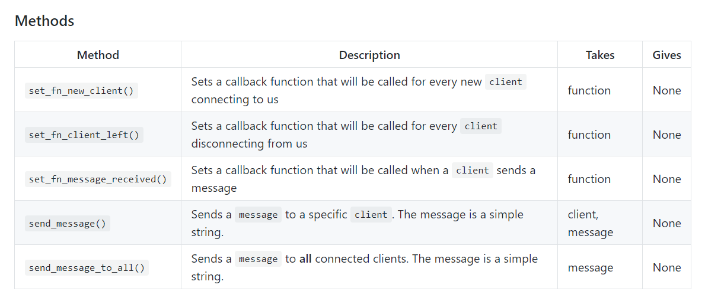

# AutomaticMachine

### 流程圖


### 功能圖
1. 先透過postman或直接在瀏覽器上面輸入對應的網址觸發api的街口後


2. 虛擬助手在這時就會跳出來跟你說別人輸入了什麼訊息給你


### 使用到的技術

**WebSocket**
* 是一種讓瀏覽器與伺服器進行一段互動通訊的技術。這個 API 在不必輪詢（poll）伺服器下，讓使用者傳送訊息至伺服器並接受事件驅動回應。
* [進行websocket 串接測試網址](http://websocket.org/echo.html) (Location : ws://127.0.0.1:7777)
* WebSocket GitHub 上的Method


**Flask框架**
* 是一個使用 Python 撰寫的輕量級 Web 應用程式框架，由於其輕量特性，也稱為 micro-framework（微框架）
* push就是一個接口，當使用者輸入對應的ip/push/message(message為輸入參數)，就會倒到該function內
```
@app.route('/push/<message>', methods=["GET"])
def get_store(message):
    g.request_started = time.time()
    rs = Services.push(message, request)
    return rs
```

* app.before_request 在請求前執行該function，這邊是儲存開始時間，用來計算使用者尋訪的api的整體時間
```
@app.before_request
def before_request():
    # 開始時間
    g.start = time.time()
```

* app.after_request 在請求後執行該function
```
@app.after_request
def after_request(response):
    # 結束時間
    query_time = time.time() - g.start
    Services.update_query_time(query_time)
    return response
```


**連接MySQL 、 sqlite3**
> - 資料庫連線
>> - ```MySQLdb.connect(host=host, user=user, password=password, db=db, charset="utf8")```
> - 進行操作(新增、刪除、修改、查詢)
> - 執行事務(確保資料的一致性)
> - commit(向DB發出訊號已完成更改)
> - rollback(當有需求視需要進行一連串的DB操作，當有一個環節出錯了，原本執行完成的也該恢復初始值)
> - close(段開連結)
> - 處理錯誤(warning, error, interfaceError....)

**Vue**

### 架設Ubuntu
> - 設定固定ip
>> - ifconfig 確定一下自己網卡型號 (ex: ens33) 
>> - cd /etc/network
>> - sudo vi interfaces 新增網路相關設定
>> - reboot
> - 安裝ssh server
>> - sudo apt-get install openssh-server
> - ping 到外部網址
>> - ping google.com
> - 再透過MobaXterm連接上該Ubuntu

#### 安裝MySQL
> - 安裝MySQL
>> - ```sudo apt-get install mysql-server```
>> - ```sudo apt install mysql-client```
>> - ```sudo apt install libmysqlclient-dev```
> - 設置MySQL允許遠端訪問
>> - 編輯 mysql.cnf
>>> - ```sudo vi /etc/mysql/mysql.conf.d/mysqld.cnf``` (把 bind-addresss = 127.0.0.1 註解掉
>> - 進入MySQL
>>> - ```mysql -u root -p```
>>> - 密碼 直接 ENTER
>> - 創建新使用者
>>> - ```create user 'eddy'@'%' identified by '你的密碼'; ```
>> - 執行授權命令
>>> - ```GRANT ALL PRIVILEGES ON *.* TO 'eddy'@'%' IDENTIFIED BY '你的密碼' WITH GRANT OPTION;```
>> - 更新設定
>>> - ```flush privileges; ```
>> - 退出 MySQL 服務
>>> - ```exit```
> - 重啟MySQL
>> - ```service mysql restart``` 


參考網址
> - https://github.com/Pithikos/python-websocket-server
> - https://medium.cm/enjoy-life-enjoy-coding/javascript-websocket-%E8%AE%93%E5%89%8D%E5%BE%8C%E7%AB%AF%E6%B2%92%E6%9C%89%E8%B7%9D%E9%9B%A2-34536c333e1b
> - https://andy6804tw.github.io/2019/01/29/ubuntu-mysql-setting/#1-%E7%B7%A8%E8%BC%AF-mysqldcnf